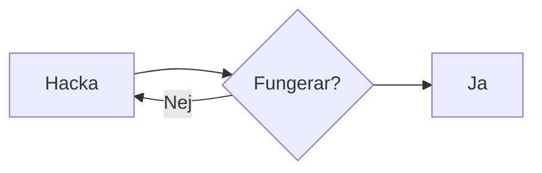
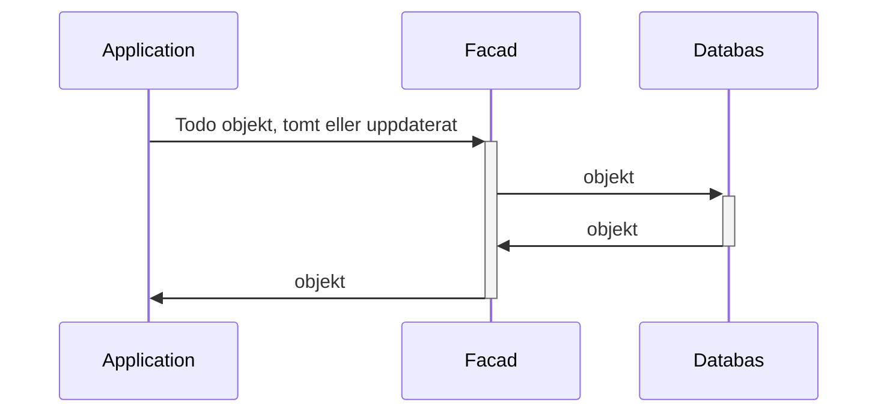
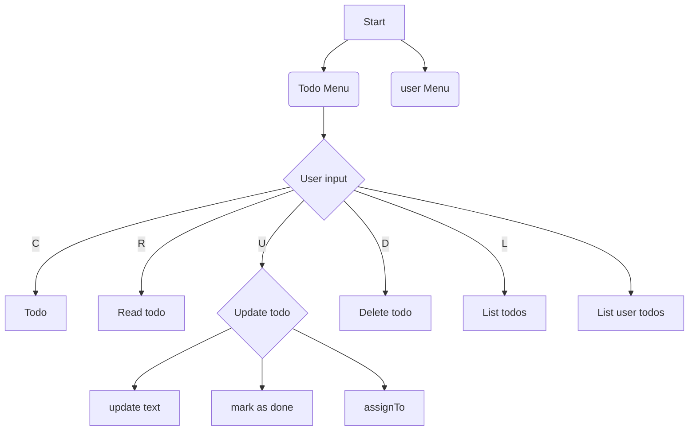
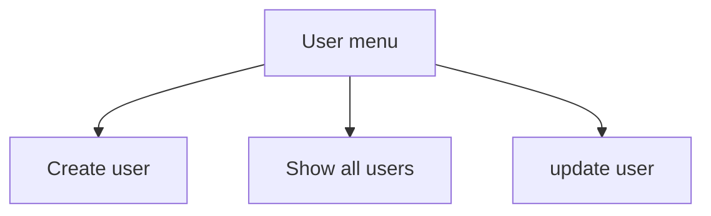
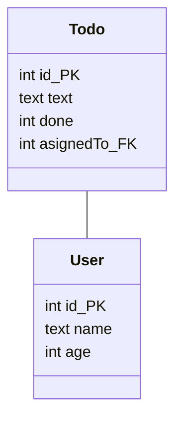
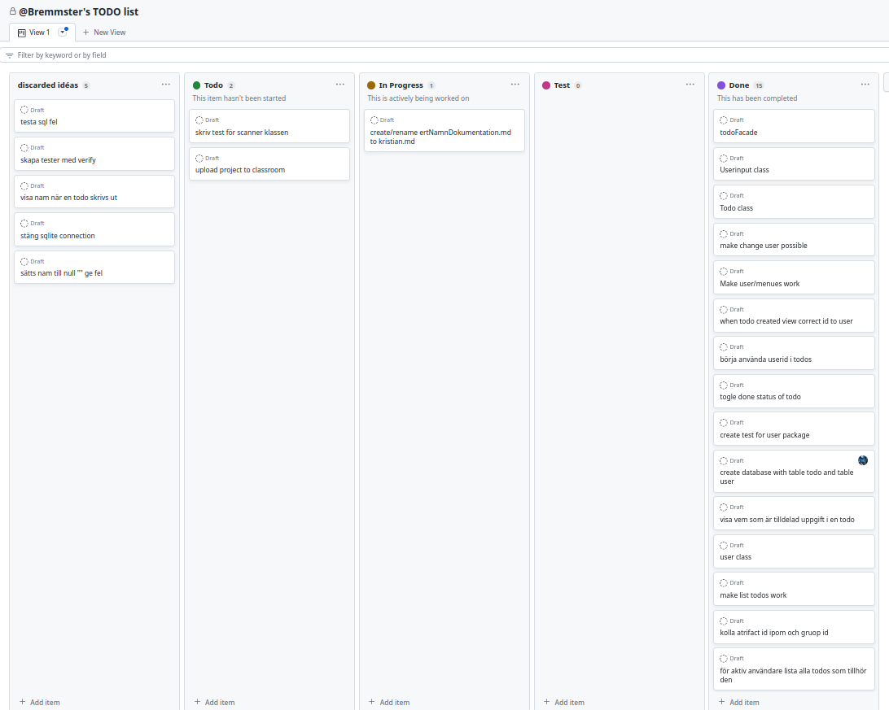

# Ditt namn
Kristian Karlson JIN VT23-HT24

## Projektet
### Beskrivning av projektet
 
Ett konsolprogram för att hålla koll på "att göra uppgifter" och användare knutet till objekten 

### Vad du har gjort
Skrivit kod, tester och CI pipe

## Planering
Grovplanering

### Lösningsförslag innan uppgiften påbörjas

#### Skisser (exempelvis)
Första lösningsidé

Flowchart för menysystemet

Databas struktur

#### Hur du tänker försöka lösa uppgiften.(exempelvis)
Skapa separata klasser för att ta emot användarkommandon och för att skriva ut text.
I första hand använd objekt till allt.

### Github Project och projekthantering enligt Scrum/Kanban
  

## Arbetet och dess genomförande

### Vad som varit svårt
Skriva bra tester, den testbara koden är klämd mellan application som bara har privata metoder och tar in input av användaren och klassen som hanterar databasen. 
Lektionen hur man skapar en CI pipe levererade inte fungerade exempel

### Beskriv lite olika lösningar du gjort
Fick problem med att databasen var ansluten flera gånger, gjorde om anslutningen till singleton.
Använder mig av två fasader för anslutningen till databas, en för saker som rör användaren den andra för todos.

### Beskriv något som var besvärligt att få till
Började med att skriva programmet mot nivån G. När det var klart började jag med VG delen med den tidigare lösningen behövde jag ändra för mig förvånansvärt mycket kod.

### Beskriv om du fått byta lösning och varför i sådana fall
Min första tanke var att Application.class bara skulle innehålla switchar och all kod skulle finnas i fasadklasserna. Det gjorde det svårt att skriva tester.
Så kod har flyttats ifrån fasadklasserna til application. 

## Reflektion & Slutsatser
Det är mycket roligare att skriva kod tillsammans i grupp, man bollar idéer och blir kreativare när man samarbetar.
När man kör själv är det lätt att glömma av att använda sin kanban board och man missar att reflektera över koden under pågående projekt. 
Periodvis var många uppgifter igång parallelt ett resultat av att jag kodade mot development istället för att skapa feature branches.

### Vad gick bra
Appen begränsar vad en användare kan mata in. Koden kan inte bli utsatt för sql injections. Klart i tid.
Scanner finns bara i en klass, lätt att kontrollera beteendet. All text finns på ett ställe, lätt att översätta appen till annat språk.

### Vad gick dåligt

Det finns några tester som egentligen inte säger jättemycket om hur applikationen fungerar. 
Ganska många av testerna är skriva efter koden.
Det är inte konsekvent var objekten skapas de kommer från olika nivåer på ett lite inkonsekvent sätt.

### Vad har du lärt dig
Hur man skapar en CI pipe. Planerat och genomfört ett projekt på egen hand.
Reflekterat kring metodiken HTDF (Hacka tills det funkar) och sen skriva tester, Kontra TDD där testerna ska skapas före koden.

### Vad hade ni gjort annorlunda om ni gjort om projektet
Börjat med att skapa CI pipe. Börjat skriva test före koden, det skulle sparat tid vid refactoring. Jag visste med mig från börja att ambitionsnivån var VG skulle skrivit appen mot de kriterier direkt och implementerande av user i applikationen. 
Skapat en in memory databas för tester.
Lagt till att användar namnet fastnar i todo objekten för att kunna visa på ett enkelt sätt.
Funderat mer på design patterns innan projektstart. Undersökt möjligheten till generiska typer. 

### Vilka möjligheter ser du med de kunskaper du fått under kursen.
Skriva bra kod med tester som bevisar att logiken fungerar. Jag har ändrat sätt kod skrivs för möjliggörande av testande. Många bra insikter i hur man skriver bra unittest och möjlighet att mocka klasser med externa beroende eller lång körtid för att snabba upp testande.

### Funktion kontrollerat av
Ellen Halvarsson
Emil Sivertsson