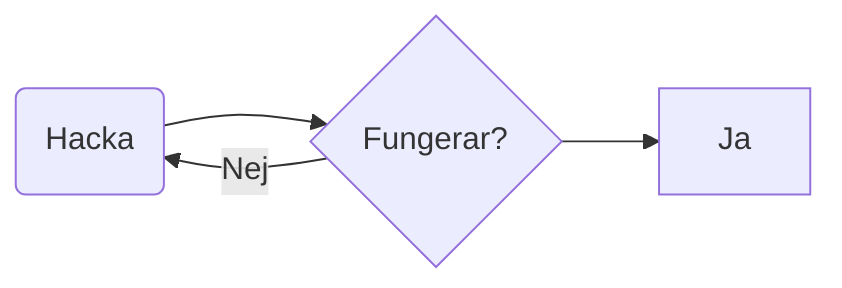
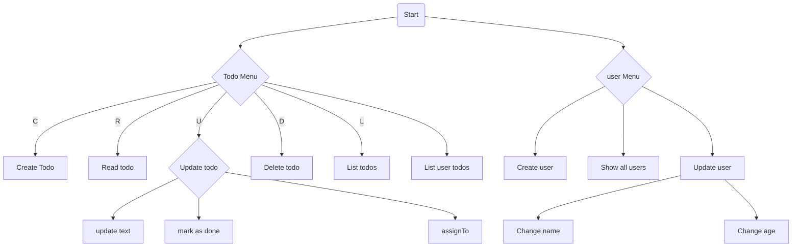
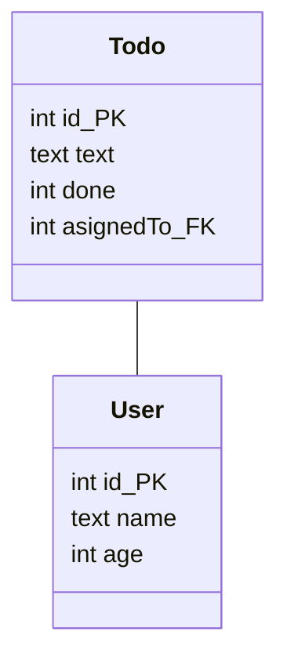

# Grovplanering
https://d4builds.gg/builds/7a132464-91a8-466c-9016-62a635002333/
## HTDF

```mermaid
flowchart LR 
    A(Hacka)
    A --> C{Fungerar?}
    C -->|Nej| A
    C --> Ja
```

Flowchart för menysystemet

``` mermaid
flowchart TD
    A(Start) --> C{Todo Menu}
    A --> usr{user Menu}
    
    C -->|C| D[Create Todo]
    C -->|R| E[Read todo]
    C -->|U| F{Update todo}
    F --> F1[update text]
    F --> F2[mark as done]
    F --> F3[assignTo]
    C --> |D|G[Delete todo]
    C --> |L|H[List todos]
    C --> I[List user todos]
    usr-->CU[Create user]
    usr-->SU[Show all users]
    usr-->UU[Update user]
    UU-->UC[Change name]
    UU-->UA[Change age]
```

Databas struktur

``` mermaid
classDiagram
Todo -- User
class Todo{
int id_PK
text text
int done
int asignedTo_FK
}
class User{
int id_PK
text name
int age
}
```
